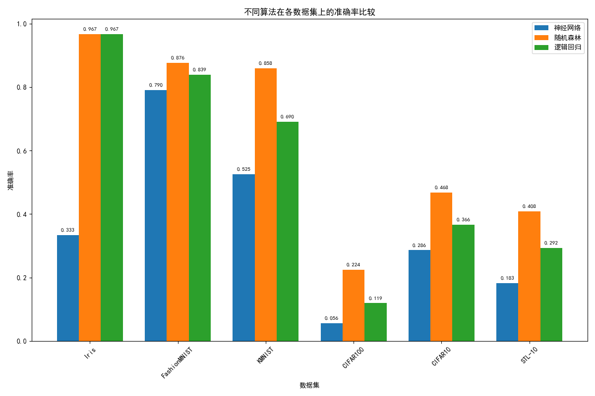

# 机器学习课程设计----分类算法对比学习研究
> 西南交通大学  2022116481  张彦博
>
>分类算法对比学习研究

本项目旨在通过系统的实验对比分析，评估逻辑回归、全连接神经网络和随机森林三种代表性分类算法在多个标准数据集上的性能，探究不同算法在不同数据特性和复杂度下的表现差异，为不同应用场景下的算法选择提供参考依据。
```
.
├── config.py              # 全局参数配置
├── logisticregress.py     # 逻辑回归模型实现
├── main.py                # 主程序  包含了训练以及测试文件
├── network.py             # 全连接神经网络模型实现
├── randomForest.py        # 随机森林模型实现
├── utils.py               # 工具函数  包含画图工具
├── algorithm_comparison.png  # 算法对比图
└── 机器学习B课设.docx      # 详细实验报告
```


## 支持的数据集
本项目支持以下数据集的分类任务：
* Iris：经典的小型分类数据集，包含 3 类鸢尾花，每类 50 个样本，每个样本有 4 个数值特征
* FashionMNIST：结构与 MNIST 一致，包含 10 种服装物品的图像
* KMNIST：替代 MNIST 的日本古典字符数据集，包含 10 类平假名字符
* CIFAR-10：包含 10 类常见物体的图像数据集
* CIFAR-100：CIFAR-10 的扩展版，包含 100 个精细类别的图像
* STL-10：专为无监督学习和半监督学习设计的图像数据集，包含 10 类常见物体


## 模型训练+预测
>模型训练以及预测都写在同一个函数中，通过调用`main.py`中train_xxx函数即可进行模型训练以及预测

1. 运行`main.py`进行训练

| 模型               | 实现文件            | 备注                                                                                                                                                                                                 |
|--------------------|---------------------|------------------------------------------------------------------------------------------------------------------------------------------------------------------------------------------------------|
| 逻辑回归           | `logisticregress.py` | - ​**模型类型**: 广义线性模型<br>- ​**映射函数**: Sigmoid函数（概率空间）<br>- ​**优化器**: L-BFGS<br>- ​**正则化**: L2正则化<br>- ​**多分类实现**: 直接优化多类别交叉熵损失（Softmax归一化）             |
| 全连接神经网络     | `network.py`         | - ​**结构**: 三层（输入层→隐藏层（3个神经元）→输出层）<br>- ​**输入/输出层**: 动态适配特征数/类别数<br>- ​**优化器**: Adam<br>- ​**损失函数**: 多分类交叉熵<br>- ​**输出层激活**: Softmax（支持多分类）   |
| 随机森林           | `randomForest.py`    | - ​**基学习器**: 决策树<br>- ​**训练策略**: 随机子样本 + 随机子特征<br>- ​**参数**: 100棵树，最大深度无限制，特征数策略=`sqrt`<br>- ​**集成方法**: Bagging<br>- ​**随机种子**: 42<br>- ​**投票机制**: 多数投票 |

2. 预测  
main函数中  每个数据集以及算法在训练后会有如下代码
```python
    # 预测测试集
    y_pred = rf.predict(X_test)
    accuracy = accuracy_score(y_test, y_pred)
    print(f"Test Accuracy: {accuracy:.4f}")
```  
用于预测。


## 预测结果


## 项目地址
GitHub仓库：https://github.com/ZYboshi/img-classify.git